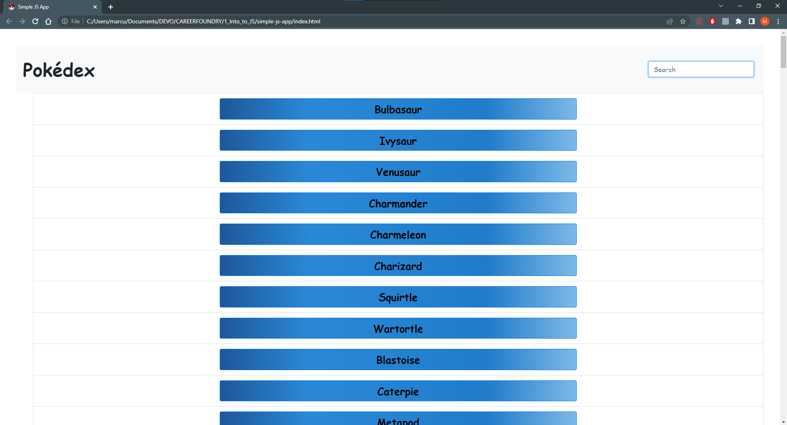
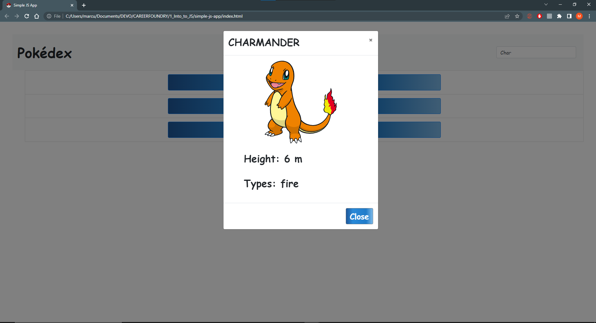
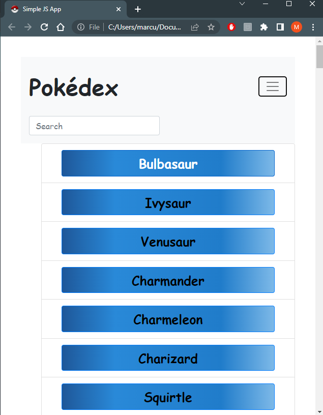

# JavaScript App - (Pokedex)

## Overview
### The challenge
Users should be able to view a list of data and see more details for a given data from public APIs.

Key features
- Load data from an external source (API)
- View a list of items
- On user action by clicking on list, view details for that item

### Screenshots:

## My process
### Build with:
* Semantic HTML5 markup
* CSS
* JavaScript
* Pokemon API
* Ajax
* Fetch polyfill
* Promise polyfill
* UI pattern of Bootstrap
    * Modal 
    * Navbar 

### What I learned 
I learned how to estabish modal as centered on the screen, contain 3 elements of title, image, and height. Adding button element as function closing the modal, pressing the escape key, or clicking outside the modal. Last, I learn how to use Immediately invoked function expressions to be isolated variable declarations. 

### Author
[Marjsky](https://github.com/Marjsky)