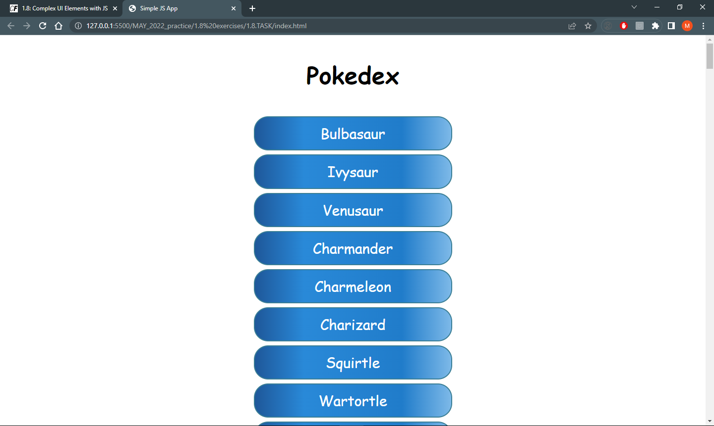

# JavaScript App - (Pokedex)

## Overview
### The challenge
Users should be able to view a list of data and see more details for a given data from public APIs.

Key features
- Load data from an external source (API)
- View a list of items
- On user action by clicking on list, view details for that item

### Screenshot

### Links
## My process
### Build with
- Semantic HTML5 markup
- CSS
- JavaScript
- Pokemon API
- Ajax
- UI pattern of modal to this app

### What I learned 

### Author
[Marjsky](https://github.com/Marjsky)